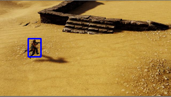

# DAC Contest
This reference design will help you walk through a design flow of DAC SDC 2020.

This is a simplified design to help users get started on the FPGA platform and to understand the overall flow. It does not contain any object detection hardware.

If you have any questions, please post on the [Piazza page](piazza.com/dac_2018/winter2020/dacsdc2020/home).

## Hardware
The base hardware design contains the Zynq MPSoC processor (A53) with a DMA and FIFO implemented in the PL.  
Note that in this starting hardware, no actual image processing/detection is done.
Pictures are:
1. sent from PS to DMA, then DMA to FIFO
2. sent back from FIFO to DMA, then DMA to PS.

Note that the FIFO should be replaced with meaningful hardware to process the pictures.

You can create a Vivado project by opening Vivado 2019.1, changing to the `hw` directory, and running `source dac_sdc.tcl`.  This will create and open a project that you can edit.  Each time you submit your files, you should run `File->Project->Write Tcl...` to generate a new tcl file to submit.  Be sure to check the `Recreate Block Designs using Tcl` box, and include any custom IP modules you use.

## Software
Note:
1. Any change in `dac_sdc.py` will make your design fail in evaluation. This file should not be changed.
2. You can use both PS and PL side to do inference.

Timing **should include the entire execution of your design, including reading the image from the SD card**, as shown in the notebook below.

Please check the reference for details. You can exclude "save_results_xml" when counting time.

Batch size is 500 by default.

Please write your results using the methods `write()` and `save_results_xml()`.

It is your choice how to record the inference result. 
However, it must be readable, and you must convert it to XML files. An example is provided.
Please place your code into `teamname.ipynb`. 
Your design should be able to process all evaluation images in five cells.


Your notebook should contain 4 code cells:
  1. Importing all libraries and creating your Team object.
  2. Downloading the overlay, and performany any one-time configuration.
  3. Processing all images.
  4. Writing results to XML and any other cleanup.

The following cells are not a real design for image detection. But you can use them to start your design. (Section 3 is broken into a few cells for demonstration purposes)

### 1. Importing all libraries


```python
import sys
import os

sys.path.append(os.path.abspath("../common"))

import math
import time
import numpy as np
from PIL import Image
from matplotlib import pyplot
import cv2
from datetime import datetime

import pynq
import dac_sdc
from IPython.display import display

team_name = 'YoLook'
batch_num = 8
team = dac_sdc.Team(team_name, batch_size=1)
```


**Your team directory where you can access your bitstream, notebook, and any other files you submit, is available as `team.team_dir`.**


### 2. Preparing the overlay and weight loading
Overlay loading must be executed in this cell.

In this sample hardware, the DMA instance is exposed as an attribute of the overlay object.  You aren't required to use DMA for your hardware solution.


```python
overlay = pynq.Overlay(team.get_bitstream_path())
dma = overlay.axi_dma1
nn_ctrl = overlay.nb_net_0
```

Data flows from PS to PL, then back to PS by DMA. Using an interrupt is recommended.

### 3. Processing Images


In this section we first demonstrate how to use then `opencv` library to read and manipuate images, then we show how to send an image to the hardware using DMA.  Finally, we demonstrate how to loop through the images and processing them, recording run-time and energy usage.  The final example will is most closely related to what you need to do.


```python
# use c code load image
import ctypes
lfuns = ctypes.cdll.LoadLibrary("load_image/load_image.so")

def c_load_image(image_paths, buff):
    paths = [str(path) for path in image_paths]
    tmp = np.asarray(buff)
    dataptr = tmp.ctypes.data_as(ctypes.c_char_p)
    paths_p_list = [ctypes.c_char_p(bytes(str_, 'utf-8')) for str_ in paths]
    paths_c = (ctypes.c_char_p*len(paths_p_list))(*paths_p_list)
    lfuns.load_image(paths_c, dataptr, len(paths))
```


```python
def load_image(img_path, new_shape=(192, 336), color=(114, 114, 114), load=True):
    # Resize image to a 32-pixel-multiple rectangle https://github.com/ultralytics/yolov3/issues/232
    img = cv2.imread(img_path)
    img = np.array(img)
    shape = img.shape[:2]  # current shape [height, width]

    # Scale ratio (new / old)
    r = min(new_shape[0] / shape[0], new_shape[1] / shape[1])

    # Compute padding
    new_unpad = int(round(shape[1] * r)), int(round(shape[0] * r))

    dw, dh = new_shape[1] - new_unpad[0], new_shape[0] - new_unpad[1]  # wh padding
    dw, dh = np.mod(dw, 64), np.mod(dh, 64)  # wh padding

    dw /= 2  # divide padding into 2 sides
    dh /= 2

    if shape[::-1] != new_unpad:  # resize
        img = cv2.resize(img, new_unpad, interpolation=cv2.INTER_LINEAR)
    top, bottom = int(round(dh - 0.1)), int(round(dh + 0.1))
    left, right = int(round(dw - 0.1)), int(round(dw + 0.1))
    
    img = cv2.copyMakeBorder(img, top, bottom, left, right, cv2.BORDER_CONSTANT, value=color)  # add border

    if load:
        img = img[:, :, ::-1].transpose(2, 0, 1)  # BGR to RGB, to 3x416x416
        img = img/2
        img = np.expand_dims(img, 0)
        img = np.concatenate((img[..., ::2, ::2], img[..., 1::2, ::2], img[..., ::2, 1::2], img[..., 1::2, 1::2]), 1)
        img = img.transpose(0,2,3,1)
        img = np.ascontiguousarray(img.astype(np.uint8)).reshape(-1,)
        img = img.astype(np.uint8).reshape(-1,)
    
    return img
```

### Pushing the picture through the pipeline
In the following example, we will also use contiguous memory arrays for sending
and receiving data.

The size of the buffer depends on the size of the input or output data.
Since the image we process in the following example (`0.jpg`) has 453x674 RGB pixels,
we will use `cma_array` of the corresponding size as well.


```python
IN_ROW = 96
IN_COL = 168
IN_CH = 12

OUT_ROW = 12
OUT_COL = 21
OUT_CH = 18

in_buffer = pynq.allocate(shape=(batch_num, IN_ROW* IN_COL* IN_CH), dtype=np.uint8, cacheable = 1)
out_buffer = pynq.allocate(shape=(batch_num, OUT_ROW* OUT_COL* OUT_CH), dtype=np.uint8, cacheable = 1)
```

Note: In the following example, we are only dealing with one image. 
We will just send one image to the FIFO and loop it back. 
In the real contest, you should process all the RGB images in every batch.

Note that the `rgb_array` has to be copied into the contiguous memory array
(deep copy).


```python
from functools import wraps

def timeFunc(func):
    """time func"""
    @wraps(func)
    def wrap(*args, **kwargs):
        start = time.time()
        func(*args, **kwargs)
        t = time.time() - start
        print("%s Cost time: %f seconds" % (func.__name__, t))

    return wrap
```


```python
team.reset_batch_count()

c_load_image = timeFunc(c_load_image)
c_load_image(team.get_image_paths(), in_buffer)

start = time.time()
for i in range(batch_num):
    in_buffer[i,:] = load_image(str(team.get_image_paths()[i]))
t = time.time() - start
print('load_image Cost time: %f seconds' % (t))
```

    c_load_image Cost time: 0.053144 seconds
    load_image Cost time: 0.277128 seconds


Now we will push the data from input buffer through the pipeline to the output buffer.


```python
def dma_transfer(batch_num):
    nn_ctrl.write(0x0, 0b0) # Reset
    # nn_ctrl.write(0x10, in_buffer0.shape[0]) 
    nn_ctrl.write(0x0, 0b1) # Deassert reset
    dma.sendchannel.transfer(in_buffer[batch_num, :])
    dma.recvchannel.transfer(out_buffer[batch_num, :])    
    dma.sendchannel.wait()
    dma.recvchannel.wait()
```

### Iterating through all images by batch, recording timing and energy measurements

In this cell, you will:
  * Perform any startup configuraton of your hardware (Download weights, etc.)
  * Measure the time and energy for processing all the images. 
  
The timer and power measurements should be running for your entire execution.  The code below shows how you can measure the total energy usage.  Make sure you follow this approach.

In the following example we will time the processing and measure energy usage of a single picture.


```python
interval_time = 0
total_time = 0
total_energy = 0
result = list()
team.reset_batch_count()
rails = pynq.get_rails()

# Start timer and energy recorder.  If this fails, then you may not have configured
# your system to measure power usage.  Follow the steps provided at
# https://github.com/jgoeders/dac_sdc_2020/blob/master/support/measure_power/README.md

start = time.time()    
recorder = pynq.DataRecorder(rails["3V3"].power)
batch_num = -1
with recorder.record(0.05):        
    while True:
        # get a batch of images
        image_paths = team.get_next_batch()
        batch_num += 1
        if image_paths is None:
            break

        c_load_image(image_paths, in_buffer[batch_num,:])
        dma_transfer(batch_num)
        result.append(out_buffer[batch_num,:])
            
# timer stop after batch processing is complete
end = time.time()
t = end - start
    
# Energy measurements    
energy = recorder.frame["3V3_power"].mean() * t    

total_time = t
total_energy = energy
print("Total time:", total_time, "seconds")
print("Total energy:", total_energy, "J")
```

    c_load_image Cost time: 0.017798 seconds
    c_load_image Cost time: 0.017366 seconds
    c_load_image Cost time: 0.022522 seconds
    c_load_image Cost time: 0.017720 seconds
    c_load_image Cost time: 0.017457 seconds
    c_load_image Cost time: 0.017404 seconds
    c_load_image Cost time: 0.017515 seconds
    c_load_image Cost time: 0.023386 seconds
    Total time: 1.4459755420684814 seconds
    Total energy: 1.1748551279306412 J


### 4. Recording results, cleanup

It is your responsibility to record your results.  You should call `team.save_results_xml(result_list, total_runtime, total_energy)` to save your results.
  * `results_list`: Each element in this list is a 4-integer list [xmin, xmax, ymin, ymax] indicating the bounding box location deterined by your object detection.  This list should have the same number of elements as there are images.  The first element in the list will correspond to image 0.jpg, etc.
  * `total_runtime`: The total runtime of your processing of all images, as described above.
  * `total_energy`: The total energy of your processing of all images, as described above.
  
The box below shows an example:


```python
dfuns = ctypes.cdll.LoadLibrary("./decode/decode.so")

def c_decode(output, result, batch_size):
    o_tmp = np.asarray(output)
    o_dataptr = o_tmp.ctypes.data_as(ctypes.c_char_p)
    r_tmp = np.asarray(result)
    r_dataptr = r_tmp.ctypes.data_as(ctypes.c_char_p)
    dfuns.decode(o_dataptr, r_dataptr, batch_size)
```


```python
GRID_ROW = 12
GRID_COL = 21
STRIDE = 16
scale = 0.23127244412899017
zero_point = 101.0

def sigmoid(x):
    s = 1 / (1 + np.exp(-x))
    return s

anchor_grid = np.array([[[[[[14., 29.]]], [[[17., 34.]]], [[[26., 36.]]]]]])
yv, xv = np.meshgrid(np.arange(GRID_ROW), np.arange(GRID_COL))
grid = np.stack((xv.T, yv.T), 2).reshape((1, 1, GRID_ROW, GRID_COL, 2)).astype(np.float32)

def yolov5(out_buffer, batch_n, result=None, normalize=True):
    x = np.array(out_buffer).reshape(batch_n, OUT_ROW, OUT_COL, OUT_CH).transpose(0,3,1,2)
    x = x.reshape(batch_n, 3, 6, GRID_ROW, GRID_COL).transpose(0, 1, 3, 4, 2)
    if normalize:
        x = scale * (x - zero_point)

    y = sigmoid(x)
    
    y[..., 0:2] = (y[..., 0:2] * 2. - 0.5 + grid) * STRIDE  # xy
    y[..., 2:4] = (y[..., 2:4] * 2) ** 2 * anchor_grid  # wh

    for xi, x in enumerate(y.reshape(batch_n, -1, 6)):
        indexs = np.argmax(x, axis=0)
        max_pred = x[indexs[4]]

        box = np.zeros_like(max_pred[0:4])
        box[0] = max_pred[0] - max_pred[2] / 2  # top left x
        box[1] = max_pred[1] - max_pred[3] / 2  # top left y
        box[2] = max_pred[0] + max_pred[2] / 2  # bottom right x
        box[3] = max_pred[1] + max_pred[3] / 2  # bottom right y
        
        result.append([int(x) for x in box])
```


```python
# These are fake object locations since the example design doesn't actually perform object detection
p_result = list()
yolov5 = timeFunc(yolov5)
yolov5(result, 8, p_result)

c_result = np.zeros((8,4), dtype=np.uint8)
c_decode = timeFunc(c_decode)
c_decode(result, c_result, 8)

team.save_results_xml(c_result.tolist(), total_time, total_energy)
print("XML results written successfully.")

# Remember to free the contiguous memory after usage.
del in_buffer
del out_buffer
```

    yolov5 Cost time: 0.013035 seconds
    yolov5 Cost time: 0.013417 seconds
    c_decode Cost time: 0.002843 seconds
    c_decode Cost time: 0.003066 seconds
    XML results written successfully.


```python
p_result = np.array(p_result)

error = abs(p_result - c_result)
print(error.max())
print(error.sum())
```

    0
    0


```python
from PIL import Image

img_paths = team.get_image_paths()
def show_img(i, result):
    img = load_image(str(img_paths[i]), load=False)
    cv2.rectangle(img, pt1=tuple(result[i][:2]), pt2=tuple(result[i][2:]), color=(255, 0, 0), thickness=2)
    img = Image.fromarray(cv2.cvtColor(img,cv2.COLOR_BGR2RGB))
    return img
    
img = show_img(0, c_result)
img
```


```python
img = show_img(1, c_result)
img
```





```python
img = show_img(2, c_result)
img
```


```python
img = show_img(3, c_result)
img
```


```python
img = show_img(4, c_result)
img
```


```python
img = show_img(5, c_result)
img
```


```python
img = show_img(6, c_result)
img
```


```python
img = show_img(7, c_result)
img
```


### What to submit

Submit your:
  * Notebook
  * .bit and .hwh files
  * The tcl file that can be used to create your Vivado project in 2019.1
  * Any supporting hardware files that Vivado needs (eg. IP)
  * Any other files your notebook needs to run (eg. weights file)
 
